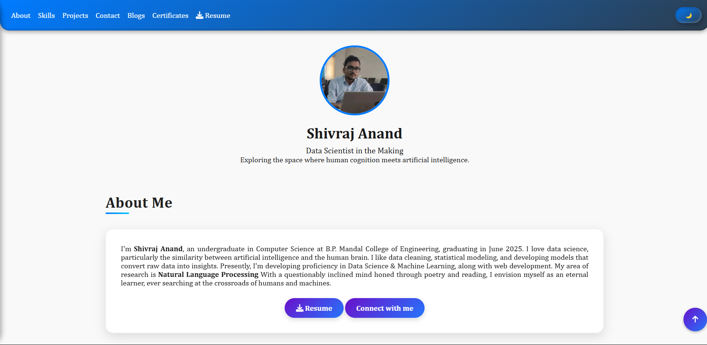

# 💼 Shivraj Anand's Portfolio

Welcome to my portfolio repository! This project showcases my work, skills, and personal projects as a Web Developer.

> 🌐 Live Portfolio: [shivrajanand.github.io](https://shivrajanand.github.io)

---

## 📌 About

This portfolio is built using:
- 🖥️ **Technologies**: HTML, CSS, JavaScript
- 🎨 **Focus areas**: Responsive design, performance, accessibility
- 🛠️ **Hosted on**: GitHub Pages

Feel free to browse through the code to get a sense of my skills and how I structure my projects.

---

## 🚫 License & Usage

**All rights reserved.**  
This repository is provided for **showcase purposes only**. You may not copy, reuse, modify, or distribute any part of this code without **explicit permission** from the author.

🔒 See the [LICENSE](./LICENSE) file for full details.

For usage inquiries, please contact: [shivrajanand022002@gmail.com](mailto:shivrajanand022002@gmail.com)

---

## 📷 Preview

---

## 📬 Contact

- 📧 Email: [shivrajanand022002@gmail.com](mailto:shivrajanand022002@gmail.com)
- 💼 LinkedIn: [linkedin.com/in/shivrajanand](https://linkedin.com/in/shivrajanand)
- 📸 Instagram: [@shivrajanandai](https://instagram.com/shivrajanandai)

---

> Built with Passion by **Shivraj Anand**
